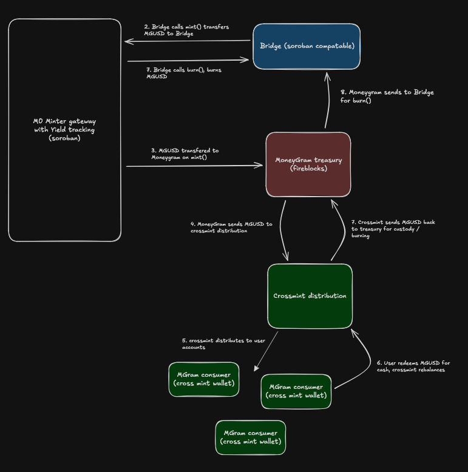

# Stellar Minter Gateway

Monorepo for the **SAC Admin Yield Token** contract and the **Fireblocks signing SDK** that invokes it.

| Directory | Description |
|-----------|-------------|
| `contracts/yieldtoone/` | Soroban yield contract — SAC admin that mints, burns, tracks yield, and enforces an allowlist |
| `soroban-sctoken-fireblocks-sdk/` | TypeScript SDK for invoking the contract via Fireblocks raw signing (Ed25519) |

---

## Contract — SAC Admin Yield Token

A Soroban yield contract that acts as the **SAC admin** for a Stellar asset. It directly mints and burns tokens via the SAC interface, tracks yield accrual on total principal, and enforces an allowlist via AUTH_REQUIRED.

## Overview

> **SAC = Stellar Asset Contract.** A SAC is the Soroban interface to a classic Stellar asset — they are the **same token**, not different ones.

This contract is set as the **SAC admin**, giving it the ability to:

- **Mint** new SAC tokens to authorized recipients (`mint`)
- **Burn** SAC tokens from accounts via clawback (`burn`)
- **Claim yield** by minting new tokens to the yield recipient (`claim_yield`)
- **Control authorization** — freeze, unfreeze, and `authorize_and_transfer`

The contract never holds user funds. Users hold tokens directly in their accounts.

## Token Flows



### Mint Flow

1. Minter (bridge) calls `mint(to, amount)` on the yield contract
2. Contract updates accumulators (`total_principal` and `total_supply`)
3. Contract mints SAC tokens directly to the recipient via `StellarAssetClient::mint`

### Burn Flow

1. Minter (bridge) calls `burn(from, amount)` on the yield contract
2. Contract updates accumulators (decreases both)
3. Contract clawbacks SAC tokens from the account via `StellarAssetClient::clawback`

### Yield Claim

1. Yield recipient calls `claim_yield()` — new SAC tokens are minted to the yield recipient
2. `total_supply` increases but `total_principal` does not — yield does not compound

### Token Distribution

The forced transfer manager calls `authorize_and_transfer(from, to, amount)` to move tokens between accounts. This temporarily authorizes the recipient, transfers tokens, then **re-freezes** the recipient to lock tokens at the destination. Accumulators are not affected — it is a balance redistribution, not a mint/burn.

## Accumulators

The contract tracks two counters:

| Accumulator | Increases when | Decreases when | Purpose |
|---|---|---|---|
| `total_principal` | `mint` | `burn`, `clawback` | Yield-earning base |
| `total_supply` | `mint` AND `claim_yield` | `burn`, `clawback` | Total outstanding tokens |

Relationship: `total_supply = total_principal + cumulative_claimed_yield`

Only `total_principal` earns yield. When yield is claimed and minted, `total_supply` grows but `total_principal` stays the same — preventing compounding.

## Yield Mechanism

### Continuous Compounding Index

The contract tracks a cumulative growth index using the continuous compounding formula:

```
currentIndex = latestIndex * e^(rate * elapsed_time / SECONDS_PER_YEAR)
```

The index is stored as a `u128` scaled by `1e12` (so `1.0 = 1_000_000_000_000`). The exponential is approximated via a 4th-order Taylor series. The index is updated before any operation that changes principal (mint, burn, rate change).

### Yield Accrual

Yield is computed on **`total_principal`** only, not on `total_supply`:

```
yield = total_principal * (newIndex - oldIndex) / INDEX_SCALE
```

This means **claimed yield does not compound**. When the yield recipient claims, new tokens are minted and `total_supply` increases, but `total_principal` stays the same.

### Interest Rate

The rate is set in basis points (100 = 1%, 10000 = 100%) and can be changed by the minter. When the rate changes, the index is finalized at the old rate before applying the new one.

## Authorization & Allowlist

The SAC issuer is configured with **AUTH_REQUIRED**, **REVOCABLE**, and **CLAWBACK_ENABLED** flags at the classic Stellar layer. This means every account starts **unauthorized** — it cannot send or receive the token until explicitly approved.

### How it works

1. Issuer flags are set on the SAC issuer account via classic Stellar (not from within Soroban)
2. New accounts are **unauthorized by default** — they cannot hold, send, or receive the token
3. The admin calls `unfreeze_account(addr)` to authorize approved accounts
4. Both **sender and receiver** must be authorized for any SAC transfer to succeed

| State | Can Send | Can Receive | How to enter |
|-------|:--------:|:-----------:|--------------|
| **Authorized** | ✓ | ✓ | Admin calls `unfreeze_account` |
| **Unauthorized** (default) | ✗ | ✗ | Default state, or admin calls `freeze_account` |

### `authorize_and_transfer` (Forced Transfer Manager)

The forced transfer manager can atomically authorize a recipient, transfer tokens, and **re-freeze** the recipient in a single call:

1. Temporarily authorizes the recipient on the SAC (`set_authorized(to, true)`)
2. Transfers tokens from sender to recipient
3. **Re-freezes the recipient** (`set_authorized(to, false)`)

The recipient ends up holding tokens but **cannot move them freely**. This prevents recipients from sending tokens to the issuer address (which would burn them without updating the yield accumulators). To allow a recipient to transfer tokens independently, the admin must explicitly call `unfreeze_account`.

This function does **not** update accumulators — it is a balance redistribution, not a mint or burn. The sender (`from`) must authorize the call.

## Compliance Controls

The admin has compliance functions for managing the allowlist and enforcing regulatory requirements.

| Function | Role | Description |
|----------|------|-------------|
| `freeze_account(account)` | Admin | Removes account from allowlist — blocks sending and receiving |
| `unfreeze_account(account)` | Admin | Adds account to allowlist — permits sending and receiving |
| `clawback(from, amount)` | Admin | Force-removes tokens from an account and decreases both accumulators |
| `authorize_and_transfer(from, to, amount)` | Forced Transfer Manager | Authorizes recipient, transfers tokens, then re-freezes recipient |
| `is_authorized(account)` | (view) | Returns whether an account is authorized |

- `freeze_account` and `unfreeze_account` call the SAC's `set_authorized` under the hood
- `clawback` finalizes yield at current rates before decreasing accumulators, then calls the SAC's `clawback`
- `clawback` does **not** require the target account's authorization — it is an admin-forced operation

## Role Hierarchy

```
Admin
├── Top-level authority
├── Can set/change Minter, Yield Recipient Manager, Forced Transfer Manager
└── Compliance: freeze, unfreeze, clawback accounts

Minter (Bridge / Issuer)
├── Mints SAC tokens directly via mint()
├── Burns SAC tokens directly via burn()
└── Sets interest rate for yield accrual via set_rate()

Yield Recipient Manager
└── Can set/change Yield Recipient address

Yield Recipient
└── Can claim accrued yield

Forced Transfer Manager
└── Can authorize a recipient and transfer tokens atomically (authorize_and_transfer)
```

## Authorization Matrix

| Function | Admin | Minter | Yield Recipient Manager | Yield Recipient | Forced Transfer Manager |
|----------|:-----:|:------:|:-----------------------:|:---------------:|:-----------------------:|
| `set_admin` | ✓ | | | | |
| `set_minter` | ✓ | | | | |
| `set_yield_recipient_manager` | ✓ | | | | |
| `set_forced_transfer_manager` | ✓ | | | | |
| `freeze_account` | ✓ | | | | |
| `unfreeze_account` | ✓ | | | | |
| `clawback` | ✓ | | | | |
| `is_authorized` | (view) | | | | |
| `mint` | | ✓ | | | |
| `burn` | | ✓ | | | |
| `set_rate` | | ✓ | | | |
| `set_yield_recipient` | | | ✓ | | |
| `claim_yield` | | | | ✓ | |
| `authorize_and_transfer` | | | | | ✓ |

## Project Structure

```
.
├── contracts/yieldtoone/src/
│   ├── lib.rs               # Module declarations and re-exports
│   ├── contract.rs          # Main contract (YieldToken) and public API
│   ├── continuous_index.rs  # e^x approximation and index math
│   ├── yield_state.rs       # Yield accrual, principal tracking, rate management
│   ├── storage_types.rs     # Storage keys, structs, TTL constants
│   ├── sac_token.rs         # SAC token address storage
│   ├── roles.rs             # Role management (minter, yield recipient manager, yield recipient, forced transfer manager)
│   ├── admin.rs             # Admin management
│   ├── events.rs            # Event definitions
│   └── test/                # Tests (103 tests)
├── soroban-sctoken-fireblocks-sdk/
│   ├── src/
│   │   ├── client.ts          # SorobanFireblocksClient (base — invoke, deploy, trustline)
│   │   ├── sctoken-client.ts  # SctokenFireblocksClient (mint, burn, setRate, setMinter, deploy)
│   │   ├── soroban-tx-builder.ts  # Transaction builders (Soroban + classic)
│   │   ├── fireblocks-signer.ts   # Fireblocks RAW Ed25519 signing
│   │   ├── scval-helpers.ts   # XDR serialization helpers
│   │   ├── config.ts          # Config loaders (issuer / minter)
│   │   ├── errors.ts          # Typed error classes
│   │   ├── types.ts           # Base SDK types
│   │   └── sctoken-types.ts   # Contract-specific param/result types
│   ├── scripts/               # CLI scripts (deploy, mint, burn, query, trustline)
│   ├── tests/                 # Unit and integration tests
│   └── package.json
├── Cargo.toml
└── README.md
```

## Building

### Contract

```bash
stellar contract build
```

### SDK

```bash
cd soroban-sctoken-fireblocks-sdk
npm install
npm run build
```

## Testing

### Contract

```bash
cargo test
```

### SDK

```bash
cd soroban-sctoken-fireblocks-sdk
npm test                # unit tests
npm run test:integration # integration tests (requires Fireblocks credentials + testnet)
```

---

## SDK — Fireblocks Signing Client

The `soroban-sctoken-fireblocks-sdk/` directory contains a TypeScript SDK that wraps the yield contract with Fireblocks MPC signing. See [`soroban-sctoken-fireblocks-sdk/README.md`](soroban-sctoken-fireblocks-sdk/README.md) for full setup, environment variables, and usage details.

### SDK Methods

| Method | Contract function | Description |
|--------|-------------------|-------------|
| `mint(caller, to, amount)` | `mint` | Mint SAC tokens to a recipient |
| `burn(caller, from, amount)` | `burn` | Burn SAC tokens from an account |
| `setRate(caller, rateBps)` | `set_rate` | Set interest rate in basis points |
| `setMinter(newMinter)` | `set_minter` | Change the minter address (admin only) |
| `queryAdmin()` | `admin` | Query the admin address |
| `querySacToken()` | `sac_token` | Query the SAC token address |
| `deployFull(...)` | — | Full deploy pipeline (configure issuer, deploy SAC, upload WASM, deploy wrapper, transfer admin) |

---

## TODO

- [ ] Implement industry standard math library (replace Taylor series with Pade approximation to match EVM precision)
- [ ] Double check rounding math (verify rounding directions are consistent and protocol-favorable across all operations)
- [ ] Investigate contract upgrade strategy
- [ ] Update SDK `deployFull` constructor args to match 6-param contract constructor
- [ ] Add remaining SDK methods (freeze, unfreeze, clawback, authorize_and_transfer, claim_yield, view functions)
