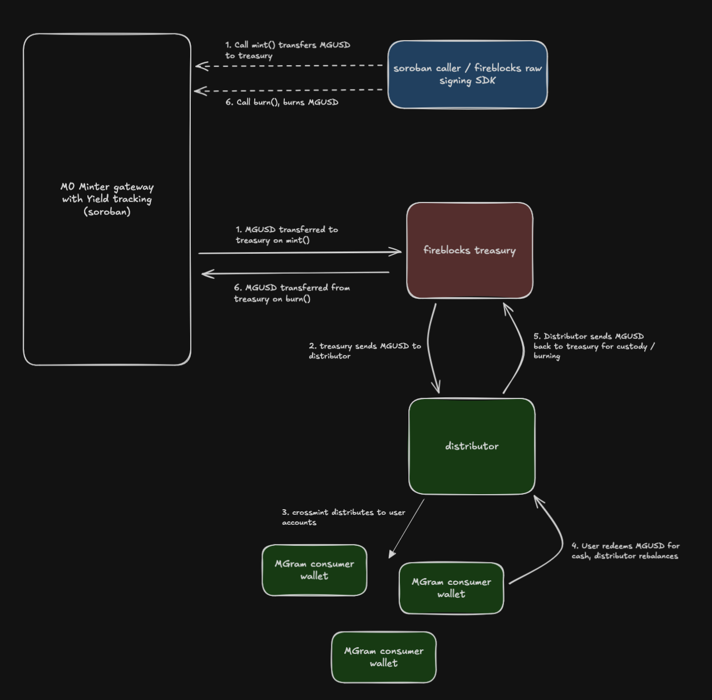

# MGUSD Implementation Overview

M0's technical proposal for MGUSD on Stellar — a yield-bearing stablecoin built as a Soroban smart contract that administers a Stellar Asset Contract (SAC). This document covers the full implementation: flows, roles, contract interface, yield mechanics, and compliance controls.

> The TypeScript Fireblocks SDK that the Bridge operator uses to invoke this contract lives on the [`sdk-integration`](https://github.com/m0-foundation/stellar-minter-gateway/tree/sdk-integration) branch. This document focuses on the contract itself.

---

## Flows

### 1. Minting (Bridge → Treasury)

1. MoneyGram receives fiat from an end user and notifies the Bridge
2. Bridge calls `mint(treasury_address, amount)` on the wrapper contract
3. Contract finalizes pending yield, increases `total_principal` and `total_supply`, then mints SAC tokens to the treasury address
4. Treasury now holds MGUSD on-ledger

### 2. User Distribution (Treasury → End User)

1. Authorized blockers whitelist (unblock) accounts — individually via `unblock_user(caller, user, source)` or in batch via `batch_unblock_users(caller, users, source)` (up to 23 per call). Each blocking party operates under its own registered source name
2. Treasury transfers tokens to the user via the SAC's standard SEP-41 `transfer()`
3. Whitelisted (unblocked) accounts can freely transfer among themselves
4. Blocked accounts cannot send or receive tokens

### 3. Redemption (End User → MoneyGram → Bridge)

1. End user initiates redemption through MoneyGram
2. Bridge calls `burn(user_address, amount)` — removes tokens at the SAC layer
3. Contract finalizes pending yield, decreases both accumulators
4. MoneyGram sends fiat to the end user off-chain

### 4. Yield Claiming (Bridge → MoneyGram)

1. Bridge calls `set_interest_rate(rate_bps)` to set the current interest rate (this is a **Minter** permission, not Admin)
2. Yield accrues continuously on `total_principal` using the exponential index
3. Yield Recipient Manager calls `claim_yield()` to mint accrued yield as new SAC tokens to the Yield Recipient
4. Claimed yield increases `total_supply` but **not** `total_principal` — it does not compound

### 5. Forced Transfer (Compliance Action)

1. Forced Transfer Manager (Crossmint) identifies a need to move tokens between accounts
2. Caller invokes `force_transfer(from, to, amount)` — no authorization from the source account is needed
3. Contract clawbacks tokens from the source and mints them to the destination at the SAC layer
4. Accumulators are unchanged — this is a balance redistribution, not a supply change
5. Works even if the source account is blocked

---

## Architecture Diagram



---

## Roles

| Role | Permissions | Intended Actor |
|------|------------|----------------|
| **Admin** | role administration only — see breakdown below | M0 |
| **Minter** | `mint`, `burn`, `set_interest_rate` | Bridge |
| **Yield Recipient Manager** | `set_yield_recipient`, `claim_yield` | M0 |
| **Yield Recipient** | passive — receives SAC tokens minted by `claim_yield` (does **not** call it) | MoneyGram |
| **Forced Transfer Manager** | `force_transfer` | Crossmint |
| **Authorized Blocker** (per source) | `block_user`, `unblock_user`, `batch_block_users`, `batch_unblock_users` under a registered source | Crossmint (typical) |
| **Pauser** (membership) | `pause`, `unpause` | M0 |

**Design properties:**

- **Admin is *not* a super-role.** Admin's powers are limited to: `set_admin`, `set_minter`, `set_yield_recipient_manager`, `set_forced_transfer_manager`, `set_authorized_blocker`, `remove_authorized_blocker`, `add_pauser`, `remove_pauser`, `reconcile_burn`, `transfer_sac_admin`, `upgrade`. Admin **cannot** call `mint`, `burn`, `set_interest_rate`, `block_user`, `unblock_user`, `batch_block_users`, `batch_unblock_users`, `force_transfer`, `claim_yield`, `set_yield_recipient`, `pause`, or `unpause` without first granting itself the relevant role.
- **No implicit emergency fallback.** A cold admin signer cannot block a user or force-move balances in an incident. If an admin-driven fallback is needed, the admin must first register itself as a blocker (`set_authorized_blocker(source, admin)`) to gain block/unblock, call `add_pauser(admin)` to gain pause, or call `set_forced_transfer_manager(admin)` to take over forced-transfer. Runbooks should plan for the dedicated role signers being reachable.
- All roles are **single-address** except **Authorized Blocker** (one address per source) and **Pauser** (membership set, granted / revoked by Admin via `add_pauser` / `remove_pauser`).
- Only Admin can reassign roles (except Yield Recipient, which is set by the Yield Recipient Manager).
- Every role-gated function calls `require_auth()` on the `caller` argument and verifies the caller equals the designated role holder — no implicit trust, no admin override.
- Roles are stored in **Instance** storage.

---

## Contract Interface

> **Note:** Each role can only call its own functions. Admin is **not** a super-role and cannot call non-admin functions without first granting itself the relevant role (see [Roles](#roles)).

### Admin-Exclusive Functions (11)

| Function | Signature | Description |
|----------|-----------|-------------|
| `set_admin` | `(new_admin: Address)` | Transfer admin role to a new address |
| `set_minter` | `(new_minter: Address)` | Set a new minter address |
| `set_yield_recipient_manager` | `(new_yrm: Address)` | Set a new yield recipient manager |
| `set_forced_transfer_manager` | `(new_ftm: Address)` | Set a new forced transfer manager |
| `set_authorized_blocker` | `(source: Symbol, blocker: Address)` | Register or update the address authorized to block/unblock under a named source (idempotent) |
| `remove_authorized_blocker` | `(source: Symbol)` | Remove a source registration entirely |
| `add_pauser` | `(addr: Address)` | Grant **pause** permission to an address (membership set; idempotent) |
| `remove_pauser` | `(addr: Address)` | Revoke **pause** permission from an address (idempotent) |
| `reconcile_burn` | `(amount: i128)` | Decrease both accumulators to reconcile tokens destroyed outside the contract (e.g., sent to issuer) |
| `transfer_sac_admin` | `(new_sac_admin: Address)` | Transfer SAC admin role from this contract to another address |
| `upgrade` | `(new_wasm_hash: BytesN<32>)` | Upgrade contract WASM to a new version |

### Minter Functions (3)

| Function | Signature | Description |
|----------|-----------|-------------|
| `mint` | `(caller: Address, to: Address, amount: i128)` | Mint SAC tokens and increase both accumulators |
| `burn` | `(caller: Address, from: Address, amount: i128)` | Remove SAC tokens and decrease both accumulators |
| `set_interest_rate` | `(caller: Address, rate_bps: u32)` | Set interest rate in basis points (max 5000 = 50%) |

### Forced Transfer Manager Functions (1)

| Function | Signature | Description |
|----------|-----------|-------------|
| `force_transfer` | `(caller: Address, from: Address, to: Address, amount: i128)` | Force-move SAC tokens between accounts (clawback + mint) |

### Yield Recipient Manager Functions (2)

| Function | Signature | Description |
|----------|-----------|-------------|
| `set_yield_recipient` | `(caller: Address, new_yr: Address)` | Set the address that receives claimed yield |
| `claim_yield` | `(caller: Address) -> i128` | Claim accrued yield; mints new SAC tokens to the yield recipient |

### Block / Unblock (allowlist) Functions (4)

All four functions require the caller to be the registered **authorized blocker** for the given `source`. Sources are named symbols (e.g. `"bridge_compliance"`, `"moneygram_onboarding"`) registered post-deploy by Admin via `set_authorized_blocker`. Multiple independent parties can block/unblock under their own source names, an account is only fully activated when all sources have cleared their blocks (union semantic). Backed by the SAC allowlist. Returns `UnknownSourceError` if the source has no registered blocker.

| Function | Signature | Description |
|----------|-----------|-------------|
| `block_user` | `(caller: Address, user: Address, source: Symbol)` | Add a block for `user` under `source`; revokes SAC authorization on first block |
| `unblock_user` | `(caller: Address, user: Address, source: Symbol)` | Remove the block for `user` under `source`; restores SAC authorization only when all sources are cleared |
| `batch_block_users` | `(caller: Address, users: Vec<Address>, source: Symbol)` | Block up to 23 users under `source` in a single transaction |
| `batch_unblock_users` | `(caller: Address, users: Vec<Address>, source: Symbol)` | Unblock up to 23 users under `source` in a single transaction |

### Pauser Functions (2)

`pause` and `unpause` require the caller to be a **pauser** (any address in the pauser membership set).

| Function | Signature | Description                                                                                                                                               |
|----------|-----------|-----------------------------------------------------------------------------------------------------------------------------------------------------------|
| `pause` | `(caller: Address)` | Pause the contract — blocks mint, burn, claim_yield, set_interest_rate (compliance ops including `force_transfer` and `reconcile_burn` remain accessible) |
| `unpause` | `(caller: Address)` | Unpause the contract — resumes all blocked operations                                                                                                     |

### View / Query Functions (19)

| Function | Returns | Description |
|----------|---------|-------------|
| `admin` | `Address` | Current admin address |
| `minter` | `Address` | Current minter address |
| `yield_recipient_manager` | `Address` | Current yield recipient manager |
| `yield_recipient` | `Address` | Current yield recipient |
| `forced_transfer_manager` | `Address` | Current forced transfer manager |
| `is_pauser(addr)` | `bool` | Whether an address has **pause** permission (membership) |
| `get_authorized_blocker(source)` | `Option<Address>` | The registered blocker for a source or `None` if unregistered |
| `blocked(account)` | `bool` | Returns `true` if any source has a block on the account or if the account is SAC-unauthorized (includes never-activated accounts) |
| `blocked_by(account, source)` | `bool` | Whether a specific source has a block on the account |
| `get_blocks(account)` | `Vec<Symbol>` | All source names that currently have a block on the account |
| `sac_token` | `Address` | SAC token contract address |
| `interest_rate` | `u32` | Current rate in basis points |
| `current_index` | `i128` | Real-time index (includes pending growth) |
| `latest_index` | `i128` | Last stored index (from most recent update) |
| `accrued_yield` | `i128` | Real-time accrued yield (stored + pending from index growth since last update) |
| `total_principal` | `i128` | Yield-earning base (mints − burns) |
| `total_supply` | `i128` | Total outstanding tokens (principal + claimed yield) |
| `balance(id)` | `i128` | SAC-reported balance for an address |
| `paused` | `bool` | Whether the contract is currently paused |

### Initialization (Constructor)

The contract is initialized via `__constructor` during deployment:

```
__constructor(sac_token, admin, minter, yield_recipient_manager, yield_recipient, forced_transfer_manager, pauser)
```

The constructor takes seven arguments: the SAC address plus six role addresses. The `pauser` argument seeds the pauser membership set with one initial address; additional pausers can be added afterwards via `add_pauser`. Block sources (authorized blockers) are **not** constructor arguments - they are registered post-deploy by Admin via `set_authorized_blocker(source, blocker)`. Returns `Err(AlreadyInitializedError)` if the contract has already been initialized (checked via `has_admin()`). The constructor does **not** initialize the yield state — index starts at `1.0` (`INDEX_SCALE`) on first use.

---

## Minter Gateway

The Minter acts as the **bridge gateway** — the sole entry point for supply changes.

### Mint

```
mint(caller: Address, to: Address, amount: i128)
```

0. Validates positive amount and caller authorization (Minter only)
1. Finalizes pending yield via `update_index()`
2. Increases `total_principal` by the present value of `amount` (`amount × INDEX_SCALE / latest_index`) and `total_supply` by the nominal `amount`
3. Cross-contract call: `StellarAssetClient::mint(to, amount)` on the SAC
4. Emits `mint` event with `(to, amount, new_total_principal, new_total_supply)`

Recipient must already be authorized (unblocked) on the SAC.

### Burn

```
burn(caller: Address, from: Address, amount: i128)
```

0. Validates positive amount and caller authorization (Minter only)
1. Finalizes pending yield via `update_index()`
2. Decreases `total_principal` by the present value of `amount` (`amount × INDEX_SCALE / latest_index`) and `total_supply` by the nominal `amount`
3. Cross-contract call: `StellarAssetClient::clawback(from, amount)` on the SAC
4. Emits `burn` event with `(from, amount, new_total_principal, new_total_supply)`

Returns `Err(BurnExceedsPrincipal)` if the present-value amount exceeds `total_principal` — you cannot burn more than was minted (prevents burning claimed yield). Does **not** require the target account's authorization.

### Set Rate

```
set_interest_rate(rate_bps: u32)
```

1. No-op if rate is unchanged
2. Calls `set_interest_rate()` which first updates the index at the old rate, then applies the new rate
3. Emits `interest_rate_set` event with `(rate_bps)`

Rate is in basis points: 100 = 1%, max 5,000 = 50%. Returns `Err(RateExceedsMax)` if rate exceeds 5,000.

### Key Properties

- **Always updates the yield index** before modifying supply (prevents yield loss/gain from ordering)
- Burns use SAC clawback internally (not transfer-to-issuer), bypassing the issuer burn problem

### Reconcile Burn

```
reconcile_burn(amount: i128)
```

Admin-only reconciliation for tokens destroyed outside the contract (e.g., sent to the SAC issuer address).

0. Validates positive amount and admin authorization
1. Finalizes pending yield via `update_index()`
2. Decreases `total_principal` by the present value of `amount` (`amount × INDEX_SCALE / latest_index`) and `total_supply` by the nominal `amount`
3. Emits `reconcile` event with `(amount, new_total_principal, new_total_supply)`

Does **not** interact with the SAC — no clawback or burn at the token layer. This is purely an accumulator correction to bring the contract's bookkeeping back in line with the actual circulating supply. See the [Issuer Burn Problem](#the-issuer-burn-problem) section for context.

---

## Forced Transfer

```
force_transfer(caller: Address, from: Address, to: Address, amount: i128)
```

Administrative token movement that does not require the source account's authorization. Forced Transfer Manager only.

1. Validates positive amount and caller role
2. Cross-contract call: `StellarAssetClient::clawback(from, amount)` on the SAC
3. Cross-contract call: `StellarAssetClient::mint(to, amount)` on the SAC
4. Emits `force_transfer` event with `(from, to, amount)`

### Key Properties

- **No accumulator changes** — supply is unchanged (tokens are moved, not created or destroyed), so `total_principal` and `total_supply` are not touched
- **No source authorization** — only the caller (Forced Transfer Manager) must authenticate; the `from` account does not need to sign
- **Works on blocked accounts** — clawback bypasses the SAC's `AUTH_REQUIRED` authorization check on the source
- **Destination must be authorized** — the `to` account must be unblocked to receive the minted tokens
- **Dedicated event** — emits `force_transfer` rather than the `mint`/`burn` supply-change events, since supply doesn't change

---

## Yield Mechanics

### Continuous Index Model

Yield accrues continuously using an exponential index:

```
currentIndex = latestIndex × e^(rate × elapsed / SECONDS_PER_YEAR)
```

Where:
- `latestIndex` — last stored index value (initialized to `1.0`, scaled as `1e12`)
- `rate` — annual rate converted from basis points (`bps / 10000 × 1e12`)
- `elapsed` — seconds since last update
- `SECONDS_PER_YEAR` — `31,536,000` (365 days)

The `e^x` approximation uses a 4th-order Taylor series: `1 + x + x²/2 + x³/6 + x⁴/24`, accurate for all realistic rates (< 20% annual).

### Two Accumulators

| Accumulator | Tracks | Modified By |
|-------------|--------|-------------|
| `total_principal` | Yield-earning base (mints − burns) | `mint`, `burn`, `reconcile_burn` |
| `total_supply` | All outstanding tokens (principal + claimed yield) | `mint`, `burn`, `reconcile_burn`, `claim_yield` |

### Yield Accrual Formula

```
yield = total_principal × (newIndex − oldIndex) / INDEX_SCALE
```

- `INDEX_SCALE` = `1e12` (fixed-point scaling factor)
- Yield is accumulated in `accrued_yield` on every index update
- Only `total_principal` earns yield — **not** `total_supply`

### Non-Compounding

When `claim_yield()` is called:
1. Pending yield is finalized via `update_index()`
2. `accrued_yield` is captured and reset to zero
3. `total_supply` increases by the claimed amount
4. New SAC tokens are minted to the yield recipient
5. `total_principal` is **unchanged** — claimed yield does not earn more yield

### Index Update Ordering

The index is updated **before** every state-changing operation (`mint`, `burn`, `reconcile_burn`, `claim_yield`, `set_interest_rate`). This ensures yield is finalized at the correct principal and rate before any changes take effect.

---

## Transfers & the Issuer Burn Problem

### SAC Transfer Mechanics

- Both sender **and** receiver must be authorized (unblocked) for a SAC transfer to succeed
- Transfers happen at the SAC layer — the wrapper contract has no `transfer()` function
- Users call the SAC's standard SEP-41 `transfer()` directly

### The Issuer Burn Problem

On classic Stellar, sending tokens to the **issuer address** burns them automatically. If a user sends MGUSD to the issuer:

- Tokens are destroyed at the SAC layer
- The wrapper contract's `total_principal` and `total_supply` are **never updated**
- Yield keeps accruing on phantom principal — breaking the yield invariant

### Mitigation: AUTH_REQUIRED + Whitelist Model

The SAC is configured with `AUTH_REQUIRED` — all accounts start unauthorized (blocked) by default.

1. Accounts can only transact after an **authorized blocker** calls `unblock_user(caller, user, source)` and all block sources are cleared
2. The issuer account has no trustline for its own asset and cannot be blocked or unblocked
3. Blocked accounts hold tokens but cannot move them (including to the issuer)

**Important caveat:** The issuer is **exempt from AUTH_REQUIRED** at the Stellar protocol level. This means authorized (unblocked) users **can** send tokens directly to the issuer via SAC `transfer()` or classic Stellar operations. The whitelist model reduces accidental issuer burns by limiting who can transact, but does not eliminate the possibility entirely. If tokens are sent to the issuer, Admin can call `reconcile_burn(amount)` to decrease both accumulators and bring the contract's bookkeeping back in line with actual circulating supply. See the [Issuer Burn Prevention section in the README](../README.md#issuer-burn-prevention) and Note 2 for details.

---

## Compliance & Safety

### Block / Unblock

- SAC operates in `AUTH_REQUIRED` mode — accounts are unauthorized (blocked) by default
- The contract uses a **multi-party, source-keyed block registry**: each blocking party registers under a named source (e.g. `"bridge_compliance"`, `"moneygram_onboarding"`) via Admin calling `set_authorized_blocker(source, blocker)` post-deploy
- `unblock_user(caller, user, source)` → removes the block for `user` under `source`; SAC `set_authorized(true)` is called only when the last block source is cleared (union semantic)
- `block_user(caller, user, source)` → adds a block for `user` under `source`; SAC `set_authorized(false)` is called on the first block
- Only the registered blocker for a given `source` can call `block_user` / `unblock_user` for that source; Admin registers blockers via `set_authorized_blocker`. Returns `UnknownSourceError` if the source has no registered blocker.
- **Batch operations:** `batch_block_users` and `batch_unblock_users` each accept up to 23 users per call and operate under a single source
- The 23-user cap is derived from Soroban's per-transaction resource limits; each user consumes write entries for the block registry and SAC authorization state
- Batch operations are atomic — if any user fails, the entire transaction reverts
- Each user in a batch emits its own `UserBlocked` / `UserUnblocked` event (OZ `stellar_tokens::fungible::blocklist` shape) for indexer compatibility

### Token Transfers

- Transfers use the SAC's standard SEP-41 `transfer()` — the wrapper contract has no transfer function
- Both sender and receiver must be active (unblocked by all sources) for a transfer to succeed
- An authorized blocker activates accounts via `unblock_user()`; any registered blocker can revoke via `block_user()`
- Transfers do **not** update accumulators — they are balance redistributions, not mints/burns
- The issuer is exempt from `AUTH_REQUIRED` — authorized users can send tokens to the issuer, which destroys them without updating accumulators (see [Issuer Burn Problem](#the-issuer-burn-problem))

---

## Pausable

The contract implements a pause mechanism via the `stellar-contract-utils` pausable extension.

### Pause / Unpause

```
pause(caller: Address)
unpause(caller: Address)
```

Only addresses in the **Pauser** membership set can call these functions. Admin grants and revokes membership via `add_pauser` / `remove_pauser`.

### Effect of pausing

When paused, the following operations revert immediately:

| Blocked function | Role |
|-----------------|------|
| `mint` | Minter |
| `burn` | Minter |
| `set_interest_rate` | Minter |
| `claim_yield` | Yield Recipient Manager |

Compliance operations (`block_user`, `unblock_user`, `batch_block_users`, `batch_unblock_users`, `set_authorized_blocker`, `remove_authorized_blocker`, `force_transfer`) and all view functions remain fully accessible while paused so that regulatory actions — sanctions enforcement, court-ordered seizures, allowlist updates — can still be executed.

`reconcile_burn` is also intentionally callable while paused. Send-to-issuer destruction happens at the SAC layer outside wrapper control and continues during a pause; blocking reconciliation while paused would let accumulator divergence grow unboundedly. The function is admin-only and only mutates wrapper bookkeeping (no SAC interaction), so the pause carries no security benefit.

---

## Event Reference

All events emitted by the contract. Event names are the snake_case form of the underlying `#[contractevent]` struct (`AdminSet` → `admin_set`, etc.). Topic fields are marked **(topic)**; remaining fields are payload data.

**Defined in `events.rs`:**

| Event | Emitted By | Fields |
|-------|-----------|--------|
| `admin_set` | `set_admin` | `old` **(topic)**, `new` |
| `minter_set` | `set_minter` | `old` **(topic)**, `new` |
| `yield_recipient_manager_set` | `set_yield_recipient_manager` | `old` **(topic)**, `new` |
| `yield_recipient_set` | `set_yield_recipient` | `old` **(topic)**, `new` |
| `forced_transfer_manager_set` | `set_forced_transfer_manager` | `old` **(topic)**, `new` |
| `authorized_blocker_set` | `set_authorized_blocker` | `source` **(topic)**, `blocker` |
| `authorized_blocker_removed` | `remove_authorized_blocker` | `source` **(topic)** |
| `pauser_added` | `add_pauser` | `addr` **(topic)** |
| `pauser_removed` | `remove_pauser` | `addr` **(topic)** |
| `interest_rate_set` | `set_interest_rate` | `rate_bps` |
| `mint` | `mint` | `to` **(topic)**, `amount`, `new_total_principal`, `new_total_supply` |
| `burn` | `burn` | `from` **(topic)**, `amount`, `new_total_principal`, `new_total_supply` |
| `reconcile` | `reconcile_burn` | `amount`, `new_total_principal`, `new_total_supply` |
| `yield_claimed` | `claim_yield` | `recipient` **(topic)**, `amount` |
| `update_index` | `update_index` (called from every supply/rate mutation) | `latest_index` |
| `force_transfer` | `force_transfer` | `from` **(topic)**, `to` **(topic)**, `amount` |
| `upgraded` | `upgrade` | `by` **(topic)**, `new_wasm_hash` |
| `sac_admin_transferred` | `transfer_sac_admin` | `new_sac_admin` **(topic)** |

**From upstream extensions:**

| Event | Emitted By | Fields | Source |
|-------|-----------|--------|--------|
| `user_blocked` | `block_user`, `batch_block_users` | `user` **(topic)** | `stellar_tokens::fungible::blocklist` |
| `user_unblocked` | `unblock_user`, `batch_unblock_users` | `user` **(topic)** | `stellar_tokens::fungible::blocklist` |
| `paused` | `pause` | *(no fields)* | `stellar_contract_utils::pausable` |
| `unpaused` | `unpause` | *(no fields)* | `stellar_contract_utils::pausable` |

---

## Invariants

Core mathematical properties the contract upholds. These should hold across every reachable state.

The present value of a nominal amount at the current index is `amount × INDEX_SCALE / latest_index`.

### Bounds

- **INV-1 — Non-negative accumulators.** `total_principal ≥ 0`, `total_supply ≥ 0`, `accrued_yield ≥ 0`.
- **INV-2 — Index floor and monotonicity.** `latest_index ≥ INDEX_SCALE` and `current_index ≥ latest_index`. The index never decreases and never falls below `1.0` (`= INDEX_SCALE`).
- **INV-3 — Rate bound.** `0 ≤ rate_bps ≤ 5_000` (0%–50% APR).

### Conservation per operation

Each state-changing call adjusts the accumulators as follows:

| Operation | Δ `total_principal` | Δ `total_supply` | SAC effect |
|-----------|---------------------|------------------|------------|
| `mint(amount)` | `+ amount × INDEX_SCALE / latest_index` | `+ amount` | `+ amount` minted to recipient |
| `burn(amount)` | `− amount × INDEX_SCALE / latest_index` | `− amount` | `− amount` clawed back from holder |
| `reconcile_burn(amount)` | `− amount × INDEX_SCALE / latest_index` | `− amount` | none (off-chain destruction already happened) |
| `claim_yield()` → `amount` | `0` | `+ amount` | `+ amount` minted to yield recipient |
| `force_transfer(amount)` | `0` | `0` | `− amount` from sender, `+ amount` to recipient |
| `set_interest_rate`, `update_index` | `0` | `0` | none |

- **INV-4 — Burn cannot exceed principal.** `burn` and `reconcile_burn` revert with `BurnExceedsPrincipal` if `amount × INDEX_SCALE / latest_index > total_principal`. Equivalently, `total_principal` is never driven negative.
- **INV-5 — Force transfer is supply-neutral.** `force_transfer` leaves `total_principal`, `total_supply`, and `accrued_yield` unchanged.
- **INV-6 — Yield does not compound.** `claim_yield` increases `total_supply` only. `total_principal` is the sole yield-earning base; claimed yield never re-enters the principal accumulator.

### Yield accrual

- **INV-7 — Pending yield identity.** Between index updates, `pending_yield = total_principal × (current_index − latest_index) / INDEX_SCALE`. After `update_index`, this pending amount is added to `accrued_yield` and `latest_index` is advanced to `current_index`.
- **INV-8 — Index-update neutrality.** `update_index` modifies only `latest_index`, `accrued_yield`, and `last_update_timestamp`. It never changes `total_principal` or `total_supply`.
- **INV-9 — Index-before-state ordering.** Every operation that mutates `total_principal`, `total_supply`, or `rate_bps` (i.e. `mint`, `burn`, `reconcile_burn`, `claim_yield`, `set_interest_rate`) finalizes the index first. Yield is therefore always accrued at the principal and rate that were in effect during the elapsed interval.
- **INV-10 — Claim resets pending yield.** Immediately after `claim_yield` returns `amount`, `accrued_yield = 0` and `total_supply` has increased by exactly `amount`.

### Supply ↔ SAC reconciliation

- **INV-11 — Supply bookkeeping.** Under normal operation (no off-contract destruction such as issuer burns), `total_supply` equals the SAC's circulating supply (sum of holder balances). When tokens are destroyed outside the contract, the SAC's circulating supply falls below `total_supply` until `reconcile_burn` is called to restore equality.
- **INV-12 — Authoritative source for supply changes.** `total_supply` only changes via `mint`, `burn`, `reconcile_burn`, and `claim_yield`. SAC `transfer` between accounts does not change `total_supply` or `total_principal`.

### Roles and access

- **INV-13 — Single-address roles are total.** `admin`, `minter`, `yield_recipient_manager`, `yield_recipient`, and `forced_transfer_manager` each resolve to exactly one address after construction. **Pauser** is a membership set. **Authorized Blocker** is a per-source mapping, each registered source maps to exactly one blocker address.
- **INV-14 — Role gating.** Every role-gated function calls `require_auth` on its `caller` argument and verifies the caller equals the designated role holder. Admin is not a super-role: it cannot exercise block/unblock powers without first registering itself as an authorized blocker via `set_authorized_blocker` and cannot exercise other roles without granting itself the relevant role.
- **INV-15 — Block union semantic.** An account's SAC authorization is `true` if and only if its block source set is empty. SAC authorization is revoked on the first `block_user` call for any source, and restored only when all sources have cleared their blocks via `unblock_user`.

---

## Deployment & Off-Chain Tooling

Two deploy paths are supported:

- **Testnet / dev:** `scripts/deploy-testnet.sh` — bash + `stellar` CLI, signing via local `stellar keys` identities. Mirrors the 5-step pipeline (configure issuer flags → deploy SAC → upload WASM → deploy wrapper → transfer SAC admin) and ends with a smoke-test of `wrapper.admin()`. Suitable for testnet and local stack work, NOT for production.

- **Production:** the [`sdk-integration`](https://github.com/m0-foundation/stellar-minter-gateway/tree/sdk-integration) branch retains a TypeScript SDK that drives the same 5-step pipeline through Fireblocks MPC custody (`MPC_EDDSA_ED25519` raw signing). Production deploys check out that branch and run its `npm run deploy` pipeline; the contract source-of-truth on `main` stays Fireblocks-free.

Bridge-side runtime invocations (`mint`, `burn`, `set_interest_rate`) are also Bridge-operator concerns and live on the `sdk-integration` branch.

